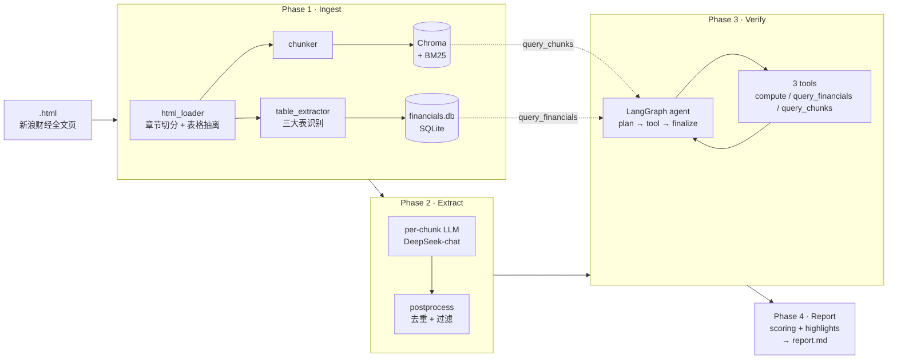

# walk-the-talk

> 给上市公司管理层的"前瞻性断言"打分：把每年年报里说的话，拿后续年份的事实回头核对。
>
> *Audit corporate management's forward-looking claims by walking back through annual reports and checking each prediction against later years' realized facts.*

[](LICENSE)
[](https://www.python.org/)
[](https://github.com/astral-sh/ruff)

---

## 这个项目在解决什么问题

每份 A 股年报的"致股东的信"和"管理层讨论与分析"里，管理层都会发一些"明年要做到 X"、"未来三年资本开支控制在 Y"、"毛利率维持在 Z 左右"这样的**可验证断言**。

但读年报的人很少回头去对：管理层 2022 年说的 2023 年承诺，到 2024 年发布的 2023 年报里到底兑现了没？这件事本来就该机器做：

1. 从历年年报里抽出每条**前瞻性断言**（claim）
2. 把这些 claim 跟**后续年份**实际披露的财务/经营数据对账
3. 给每条 claim 打一个 verdict：**verified / partially_verified / failed / not_verifiable / premature**
4. 综合出一个公司管理层的"说到做到"分数

`walk-the-talk` 把这套流程做成了一个 4 阶段流水线：每个阶段 CLI 子命令独立、产物落盘解耦——改 prompt 只需重跑对应阶段，不需要回到 ingest 重抽 chunk。

---

## 中芯国际（688981）实跑结果

用 SMIC FY2021–FY2025 五年年报做了一次端到端跑批：

| 指标 | 数 |
|---|---:|
| 抽出的前瞻 claim | 22 |
| ✅ verified | 3 |
| ⚠️ partially_verified | 1 |
| ❌ failed | 2 |
| ❓ not_verifiable | 8 |
| ⏳ premature（窗口未到） | 8 |
| **整体可信度** | **58** / 100 |
| 量化承诺命中率 | 83 / 100 |
| 资本配置准确度 | 33 / 100 |

报告里挑出来的两条**大幅落空（FAILED）**——都是 capex 持平诺言两次违约：

> **[FY2022-005]** "资本开支与上一年相比大致持平" — FY2023 实际 capex 53.87B 元 vs FY2022 42.21B 元，增长约 **27.6%**。
>
> **[FY2024-004]** "资本开支与上一年持平" — FY2025 实际 capex 599.51 亿元 vs FY2024 545.59 亿元，增长约 **9.9%**。

最值钱的 **VERIFIED**：

> **[FY2022-003]** "毛利率在 20% 左右" — 实际 FY2023 毛利率 21.89%，符合。
>
> **[FY2022-004]** "折旧同比增长超两成" — 实际 FY2023 折旧 26.5% 同比增长，超过 20% 门槛。

完整报告样例见 [`docs/sample_report.md`](#)（项目跑通后由 `walk-the-talk report` 自动生成）。

---

## 架构



**为什么是 4 阶段而不是端到端**：每个阶段产物独立落盘（`chunks` 进 Chroma、`financials.db`、`claims.json`、`verdicts.json`、`report.md`），调任何一个阶段的 prompt 都不需要回头重抽 chunk。每个阶段都有 `--no-resume` 和按年/按 claim_id 的 filter，迭代成本低。

---

## 安装

要求 Python 3.10+，建议 macOS / Linux。

```bash
git clone git@github.com:yangmo/walk-the-talk.git
cd walk-the-talk
python3 -m venv .venv
source .venv/bin/activate
pip install -e ".[dev]"
```

LLM 用 [DeepSeek](https://platform.deepseek.com/)（成本远低于 GPT-4o，对中文年报抽取效果接近）。把 API key 写进 `.env`：

```bash
cp .env.example .env
# 编辑 .env 填 DEEPSEEK_API_KEY=...
```

---

## 5 分钟快速上手

把要分析的公司年报 HTML 放进一个目录，文件名格式 `<year>.html`：

```
data/中芯国际/
├── 2021.html
├── 2022.html
├── 2023.html
├── 2024.html
└── 2025.html
```

> HTML 来源是新浪财经的"全部公告详情页"（`vCB_AllBulletinDetail.php`），手动下载——不内置爬虫。
> [详见 design.md §0.2](design.md#02-html-来源约定)

四个阶段挨个跑：

```bash
# Phase 1：解析 HTML、抽 chunk、落 financials.db（首次约 3-5 min/公司）
walk-the-talk ingest data/中芯国际 -t 688981 -c "中芯国际"

# Phase 2：抽前瞻 claim（约 5 min/公司，并发 5）
walk-the-talk extract data/中芯国际 -t 688981 -c "中芯国际"

# Phase 3：用后续年份事实校验 claim（约 3-8 min/公司，看 claim 数）
walk-the-talk verify data/中芯国际 -t 688981 -c "中芯国际"

# Phase 4：生成 markdown 报告
walk-the-talk report data/中芯国际 -t 688981 -c "中芯国际"
```

或一键全跑：

```bash
./scripts/run_all.sh -d data/中芯国际 -t 688981 -c "中芯国际"
```

产物全部落在 `data/中芯国际/_walk_the_talk/`：

```
_walk_the_talk/
├── chroma/                  # Chunk dense vectors (BGE-small-zh)
├── bm25.pkl                 # BM25 sparse index (jieba 分词)
├── financials.db            # SQLite，三大表 + 派生字段
├── llm_cache.db             # SQLite-backed prompt cache
├── claims.json              # 22 条前瞻断言（Phase 2 输出）
├── verdicts.json            # 验证结果 + tool trace（Phase 3 输出）
└── report.md                # 最终报告（Phase 4 输出）
```

---

## 技术选型与权衡

| 维度 | 选择 | 为什么 |
|---|---|---|
| 输入格式 | **HTML（手动下载）** | 实测 HTML 比 PDF 噪音少 70%，章节切分一行正则解决，表格 `<tr><td>` 直读不会列错位。详见 [design.md §0.1](design.md#01-为什么选-html-而不是-pdf) |
| 中文 embedding | **BGE-small-zh-v1.5**（512 维） | 中文金融语义检索 SOTA-tier，CPU 单核能跑，~100MB 模型；混搜里和 BM25 互补 |
| 向量库 | **Chroma**（持久化） | 单文件部署、Python 原生、足够 ~10K chunks 量级；不引入 Docker / Postgres |
| 关键词检索 | **rank_bm25 + jieba** | 公司名、产品代号、line item 名（如"营业收入"）这种精确词，BM25 召回远好于 dense |
| LLM | **DeepSeek-chat / -reasoner** | chat 比 GPT-4o-mini 便宜 ~10x，质量在中文年报抽取场景接近；reasoner 做降级兜底 |
| Verify 编排 | **LangGraph 状态机**（per-claim） | plan ↔ tool ↔ finalize 的循环天然是状态机；rescue gate 让 NOT_VERIFIABLE 走第二轮 |
| 数值计算 | **`compute(expr)` 工具** + AST 白名单 | 数值比较交给工具，不让 LLM 心算——彻底消除算术幻觉 |
| 缓存 | **SQLite (WAL)** prompt cache | 跑一遍 SMIC 22 条 claim 后第二次 verify 90%+ cache 命中，调 prompt 几乎零成本 |

---

## 项目结构

```
walk_the_talk/
├── core/                    # 跨 phase 共享：Pydantic 模型、枚举、ID 生成
│   ├── models.py            #   ParsedReport / Chunk / Claim / VerificationRecord ...
│   ├── enums.py             #   ClaimType / Verdict / SectionCanonical ...
│   └── ids.py
├── ingest/                  # Phase 1：HTML → chunks + financials
│   ├── html_loader.py       #   GBK 解码、章节切分、<table> 抽离
│   ├── chunker.py           #   段落切分 + 表格独立成 chunk
│   ├── table_extractor.py   #   三大表识别 + 单位归一 + first-win 去重
│   ├── reports_store.py     #   Chroma + BM25 双索引
│   └── financials_store.py  #   SQLite 持久化
├── extract/                 # Phase 2：chunks → claims
│   ├── prompts.py           #   抽取 system prompt + few-shot
│   ├── extractor.py         #   per-chunk 抽取 + reasoner 降级
│   └── postprocess.py       #   去重 / 过滤 / horizon 时效过滤
├── verify/                  # Phase 3：claims + financials → verdicts
│   ├── agent.py             #   LangGraph 状态机 + rescue gate
│   ├── tools.py             #   compute / query_financials / query_chunks（+ 派生字段）
│   └── prompts.py
├── report/                  # Phase 4：verdicts → markdown
│   ├── builder.py
│   ├── scoring.py           #   整体 / 量化承诺 / 资本配置 三个维度
│   ├── highlights.py        #   FAILED / VERIFIED / PREMATURE 高亮挑选
│   └── templates.py
├── llm/                     # LLM 客户端 + cache + retry
└── cli.py                   # Typer 入口

tests/                       # 100+ pytest，含 SMIC 2025 端到端 fixture
```

---

## 开发

```bash
# 安装 dev 依赖
pip install -e ".[dev]"

# 跑测试
pytest -x

# 跑代码检查
ruff check walk_the_talk/

# SMIC 端到端跑通验证（需 .env 里有 DEEPSEEK_API_KEY）
./scripts/run_all.sh
```

详细架构决策、prompt 设计、验证方法见仓库根的 [`design.md`](design.md)；版本变更见 [`CHANGELOG.md`](CHANGELOG.md)。

---

## Roadmap

- [x] v0.1：单公司、HTML 输入、4 阶段端到端，SMIC 验证跑通
- [ ] v0.2：跨公司对比（"看同行业谁最爱违约"）
- [ ] v0.3：季报支持（目前只年报）
- [ ] v0.4：HTML 报告（带 evidence 折叠 + 时间轴可视化）
- [ ] v0.5：Reranker 提升 query_chunks 召回精度

---

## License

[MIT](LICENSE) © 2026 Mo Yang
