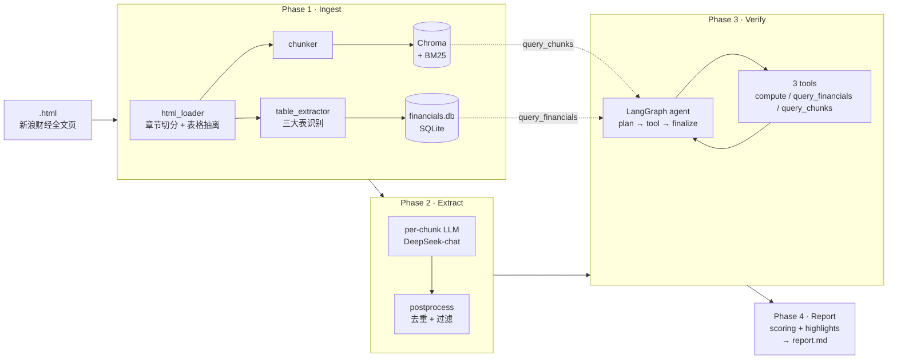

# walk-the-talk

> 给上市公司管理层的"前瞻性断言"打分：把每年年报里说的话，拿后续年份的事实回头核对。

[](LICENSE)
[](https://www.python.org/)
[](https://github.com/astral-sh/ruff)
[](#%E9%A1%B9%E7%9B%AE%E7%8A%B6%E6%80%81%E4%B8%8E%E5%85%8D%E8%B4%A3%E5%A3%B0%E6%98%8E)

---

## 这个项目在解决什么问题

每份 A 股年报的"致股东的信"和"管理层讨论与分析"里，管理层都会发一些"明年要做到 X"、"未来三年资本开支控制在 Y"、"毛利率维持在 Z 左右"这样的**可验证断言**（claim）。

但读年报的人很少回头去对：管理层在 2022 年年报里说的关于 2023 年的承诺，到 2024 年发布的 2023 年报里到底兑现了没？这件事本来就该机器做：

1. 从历年年报里抽出每条**前瞻性断言**（claim）
2. 把这些断言跟**后续年份**实际披露的财务/经营数据对账
3. 给每条断言打一个判定（verdict）：已兑现 / 部分兑现 / 没兑现 / 无法验证 / 窗口未到
4. 综合出一个公司管理层的"说到做到"分数

`walk-the-talk` 把这套流程做成了一个 4 阶段流水线：每个阶段独立成 CLI 子命令、产物落盘解耦——改 prompt 只需重跑对应阶段，不需要回到第一步重抽 chunk。

---

## 整体架构（high-level）

`walk-the-talk` 是一个 **检索增强生成**（RAG，Retrieval-Augmented Generation） + **工具调用智能体**（tool-using agent）的复合管线。整体可以理解成两条互相喂数据的链路：

- **结构化链路**（数据层）：HTML 表格 → 单位归一 → SQLite 财务库（`financials.db`）→ 验证阶段的 `query_financials` 工具直查
- **非结构化链路**（语义层）：HTML 正文 → 章节 + 段落切分 → 中文向量化（BGE-small-zh）→ **Chroma 向量库 + BM25 关键词索引** → 验证阶段的 `query_chunks` 工具混搜（向量 + 关键词，用 RRF 融合排序）

第三阶段（Verify）的核心是一个 **LangGraph 状态机**：

- `plan` 节点（LLM）决定下一步调哪个工具
- `call_tool` 节点执行工具（`compute` / `query_financials` / `query_chunks`）
- `finalize` 节点产出 verdict
- **rescue 机制**：当 `finalize` 第一次给"无法验证"时，若仍有调用预算且尚未做过原文重检索，强制回到 `plan` 走一轮新检索（同义词扩展 / 拓宽时间窗 / 提高 top-k）；救援轮即使最终给"已兑现"也强制下调为"部分兑现"，宁愿低估不高估。

为什么用 LangGraph 而不是手写循环：plan ↔ tool ↔ finalize 是天然的有向图，节点之间只通过 TypedDict 状态通信，调试时可以直接画出当前流程；rescue 这种"一次性强制回环"用 LangGraph 的条件边写起来比 if/while 嵌套清晰得多。

数值计算交给独立的 `compute(expr)` 工具——基于 AST 白名单（abstract syntax tree），只允许算术、比较、布尔、`abs/min/max/round` 等节点，其余一律拒绝。这是消除 LLM 算术幻觉（hallucination）最直接的办法：LLM 只决定"调什么工具传什么参数"，不让它心算。

---

## 项目状态与免责声明

> ⚠️ **本项目仍在开发中，当前生成的 `report.md` 不能作为投资判断依据。**
>
> - **抽取阶段**：DeepSeek-chat 对前瞻性断言的识别约 80% 准确，剩余 20% 含误抽（把当期事实当成承诺）或漏抽。
> - **数值校验阶段**：`financials.db` 仍存在已知的"单位归一"（unit-normalization）bug——FY2024 营收量级与公开披露数据相差约 5 倍（详见 [design.md §14.1](design.md#141-已知-issue-unit-normalization-bug高优先级)）；这条会污染所有"持平 / 增幅 X%" 类 claim 的判定结果。
> - **整体可信度评分**：分母只算"已兑现 / 部分兑现 / 没兑现"三类，不惩罚数据缺失，但单一公司样本下评分波动很大，不具备跨公司可比性。
>
> 后续凡是出现中芯国际报告数字（如"整体可信度 58"、verdict 分布）都来自当前未修 bug 的版本，仅作为 **流水线跑通的演示**，不是对中芯国际管理层的真实评价。

---

## 中芯国际（688981）跑通演示

> ⚠️ 下面所有数字仅用于展示流水线各阶段的产出形态，**不是对中芯国际管理层的真实评价**；修完已知 bug 后再发布的版本会有更可信的数字。

用中芯国际 FY2021–FY2025 五年年报做了一次端到端跑批：

| 指标 | 数 |
|---|---:|
| 抽出的前瞻断言（claim） | 22 |
| ✅ 已兑现（verified） | 3 |
| ⚠️ 部分兑现（partially_verified） | 1 |
| ❌ 没兑现（failed） | 2 |
| ❓ 无法验证（not_verifiable） | 8 |
| ⏳ 窗口未到（premature） | 8 |
| **整体可信度（演示）** | 58 / 100 |
| 量化承诺命中率（演示） | 83 / 100 |
| 资本配置准确度（演示） | 33 / 100 |

样本输出（**结论本身受 bug 影响，仅用于看流水线怎么呈现 verdict**）：

**"没兑现"案例**：

> **\[FY2022-005\]** "资本开支与上一年相比大致持平" — FY2023 实际资本开支 538.7 亿元 vs FY2022 422.1 亿元，增长约 27.6%。

**"已兑现"案例**：

> **\[FY2022-003\]** "毛利率在 20% 左右" — 实际 FY2023 毛利率 21.89%，符合。

完整报告样例由 `walk-the-talk report` 命令自动生成，**该报告同样是演示性质，不能直接拿去做投资判断**。

---

## 详细架构图



**为什么是 4 阶段而不是端到端**：每个阶段产物独立落盘（chunks 进 Chroma、`financials.db`、`claims.json`、`verdicts.json`、`report.md`），调任何一个阶段的 prompt 都不需要回头重抽 chunk。每个阶段都有 `--no-resume` 和按年/按 claim 编号的过滤参数，迭代成本低。

---

## 安装

要求 Python 3.10 以上，建议 macOS / Linux。

```bash
git clone git@github.com:yangmo/walk-the-talk.git
cd walk-the-talk
python3 -m venv .venv
source .venv/bin/activate
pip install -e ".[dev]"
```

LLM 用 [DeepSeek](https://platform.deepseek.com/)（成本远低于 GPT-4o，对中文年报抽取效果接近）。把 API key 写进 `.env`：

```bash
cp .env.example .env
# 编辑 .env 填 DEEPSEEK_API_KEY=...
```

---

## 5 分钟快速上手

把要分析的公司年报 HTML 放进一个目录，文件名格式 `<year>.html`：

```
data/中芯国际/
├── 2021.html
├── 2022.html
├── 2023.html
├── 2024.html
└── 2025.html
```

> HTML 来源是新浪财经的"全部公告详情页"（`vCB_AllBulletinDetail.php`），手动下载——不内置爬虫。
> 详见 [design.md §0.2](design.md#02-html-来源约定)。

四个阶段挨个跑：

```bash
# Phase 1：解析 HTML、抽 chunk、落 financials.db（首次约 3-5 分钟/公司）
walk-the-talk ingest data/中芯国际 -t 688981 -c "中芯国际"

# Phase 2：抽前瞻断言（约 5 分钟/公司，并发 5）
walk-the-talk extract data/中芯国际 -t 688981 -c "中芯国际"

# Phase 3：用后续年份事实校验断言（约 3-8 分钟/公司，看断言数）
walk-the-talk verify data/中芯国际 -t 688981 -c "中芯国际"

# Phase 4：生成 markdown 报告（⚠️ 当前是开发版本，输出仅供流水线演示，不做投资判断）
walk-the-talk report data/中芯国际 -t 688981 -c "中芯国际"
```

或一键全跑：

```bash
./scripts/run_all.sh -d data/中芯国际 -t 688981 -c "中芯国际"
```

产物全部落在 `data/中芯国际/_walk_the_talk/`：

```
_walk_the_talk/
├── chroma/                  # chunk 向量索引（BGE-small-zh）
├── bm25.pkl                 # 关键词索引（jieba 分词）
├── financials.db            # SQLite，三大表 + 派生字段
├── llm_cache.db             # SQLite-backed prompt 缓存
├── claims.json              # 前瞻断言（Phase 2 输出）
├── verdicts.json            # 验证结果 + 工具调用轨迹（Phase 3 输出）
└── report.md                # 最终报告（Phase 4 输出）
```

---

## 技术选型与权衡

| 维度 | 选择 | 为什么 |
|---|---|---|
| 输入格式 | **HTML（手动下载）** | 实测 HTML 比 PDF 噪音少 70%，章节切分一行正则解决，表格 `<tr><td>` 直读不会列错位。详见 [design.md §0.1](design.md#01-为什么选-html-而不是-pdf) |
| 中文向量化（embedding） | **BGE-small-zh-v1.5**（512 维） | 中文金融语义检索 SOTA-tier，CPU 单核能跑，模型~100MB；与 BM25 在混搜里互补 |
| 向量库 | **Chroma**（持久化） | 单文件部署、Python 原生、足够 ~10K chunks 量级；不引入 Docker / Postgres |
| 关键词检索 | **rank_bm25 + jieba** | 公司名、产品代号、line item 名（如"营业收入"）这种精确词，BM25 召回远好于向量 |
| LLM | **DeepSeek-chat / -reasoner** | chat 比 GPT-4o-mini 便宜 ~10 倍，中文年报抽取质量接近；reasoner 做降级兜底 |
| 验证编排 | **LangGraph 状态机**（per-claim） | plan ↔ tool ↔ finalize 的循环天然是状态机；rescue gate 让"无法验证"走第二轮 |
| 数值计算 | **`compute(expr)` 工具** + AST 白名单 | 数值比较交给工具，不让 LLM 心算——彻底消除算术幻觉 |
| 缓存 | **SQLite (WAL)** prompt 缓存 | 跑一遍 22 条 claim 后第二次 verify 90%+ 命中，调 prompt 几乎零成本 |

---

## 项目结构

```
walk_the_talk/
├── core/                    # 跨 phase 共享：Pydantic 模型、枚举、ID 生成
│   ├── models.py            #   ParsedReport / Chunk / Claim / VerificationRecord ...
│   ├── enums.py             #   ClaimType / Verdict / SectionCanonical ...
│   └── ids.py
├── ingest/                  # Phase 1：HTML → chunks + financials
│   ├── html_loader.py       #   GBK 解码、章节切分、<table> 抽离
│   ├── chunker.py           #   段落切分 + 表格独立成 chunk
│   ├── table_extractor.py   #   三大表识别 + 单位归一 + first-win 去重
│   ├── reports_store.py     #   Chroma + BM25 双索引
│   └── financials_store.py  #   SQLite 持久化
├── extract/                 # Phase 2：chunks → claims
│   ├── prompts.py           #   抽取 system prompt + few-shot
│   ├── extractor.py         #   per-chunk 抽取 + reasoner 降级
│   └── postprocess.py       #   去重 / 过滤 / horizon 时效过滤
├── verify/                  # Phase 3：claims + financials → verdicts
│   ├── agent.py             #   LangGraph 状态机
│   ├── rescue.py            #   P4 rescue gate + ceiling
│   ├── tools.py             #   compute / query_financials / query_chunks（含派生字段）
│   └── prompts.py
├── report/                  # Phase 4：verdicts → markdown
│   ├── builder.py
│   ├── scoring.py           #   整体 / 量化承诺 / 资本配置 三个维度
│   ├── highlights.py        #   FAILED / VERIFIED / PREMATURE 高亮挑选
│   └── templates.py
├── llm/                     # LLM 客户端 + 缓存 + 重试
└── cli.py                   # Typer 入口

tests/                       # 100+ pytest，按 phase 分子目录
├── ingest/  extract/  verify/  report/
├── conftest.py              # 顶层共享 fixture（SMIC 端到端 fixture）
└── fixtures/中芯国际/2025.html
```

---

## 开发

```bash
# 安装 dev 依赖
pip install -e ".[dev]"

# 跑测试
pytest -x

# 跑代码检查
ruff check walk_the_talk/

# SMIC 端到端跑通验证（需 .env 里有 DEEPSEEK_API_KEY）
./scripts/run_all.sh
```

详细架构决策、prompt 设计、验证方法见仓库根的 [`design.md`](design.md)；版本变更见 [`CHANGELOG.md`](CHANGELOG.md)。

---

## Roadmap

- [x] v0.1：单公司、HTML 输入、4 阶段端到端，中芯国际验证跑通
- [ ] v0.2：跨公司对比（"看同行业谁最爱违约"）
- [ ] v0.3：季报支持（目前只年报）
- [ ] v0.4：HTML 报告（带 evidence 折叠 + 时间轴可视化）
- [ ] v0.5：reranker 提升 `query_chunks` 召回精度

---

## License

[MIT](LICENSE) © 2026 Mo Yang
